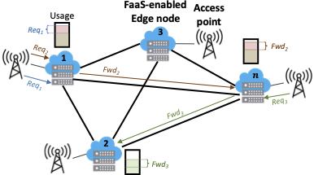

# DFaaS: Decentralized Function-as-a-Service for Federated Edge 
This repository holds DFaaS, a novel decentralized FaaS-based architecture designed to automatically and autonomously balance the traffic load across edge nodes belonging to federated Edge Computing ecosystems.

DFaaS implementation relies on an overlay peer-to-peer network and a distributed control algorithm that takes decisions on load redistribution. Although preliminary, our results confirm the feasibility of the approach, showing that the system can transparently redistribute the load across edge nodes when they become overloaded.

Our prototype is based on OpenFaaS and implements the control logic within Go P2P agents.

This research work is conducted by the INteraction and SemantIcs for Innovation with Data & Services (INSID&S) Laboratory of the University of Milano - Bicocca.

If you wish to reuse this source code, please consider citing our article describing the first prototype:

> Michele Ciavotta, Davide Motterlini, Marco Savi, Alessandro Tundo  
> [**DFaaS: Decentralized Function-as-a-Service for Federated Edge Computing**](https://doi.org/10.1109/CloudNet53349.2021.9657141),  	
> 2021 IEEE 10th International Conference on Cloud Networking (CloudNet), DOI: 10.1109/CloudNet53349.2021.9657141.

## Scenario

The above figure depicts the considered network scenario. A set of geographically-distributed _FaaS-enabled edge nodes_ (or simply _edge nodes_) is deployed at the edge of the access network. 

Each of these nodes deploys a _DFaaS platform_ for the execution of _serverless functions_, and is connected to a wireless or wired _access point_ (e.g. a base station, a broadband network gateway, a WiFi access point, etc.).

The edge node can receive functions' execution _requests_, in the form of HTTP requests, generated by the _users_ served by the access point.

## Architecture

## Simulation

In this work it has also implemented a simulator to test and compare different load balancing techniques. The simulation code is available under _simulation_ directory. For more informations read associated [**README**](simulation/README.md) file.

Data, gathered by the DFaaS system, used for simulation, are available [**here**](data/).
