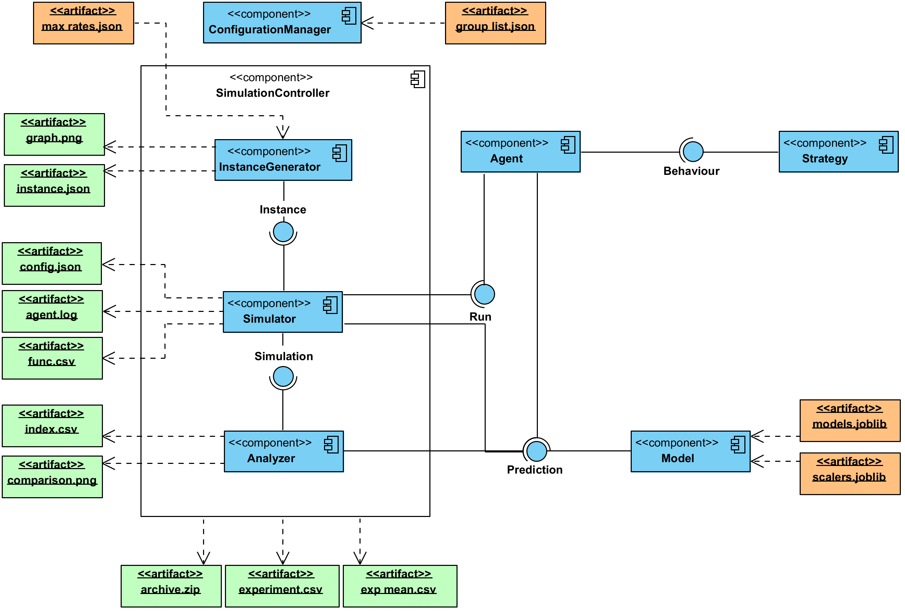
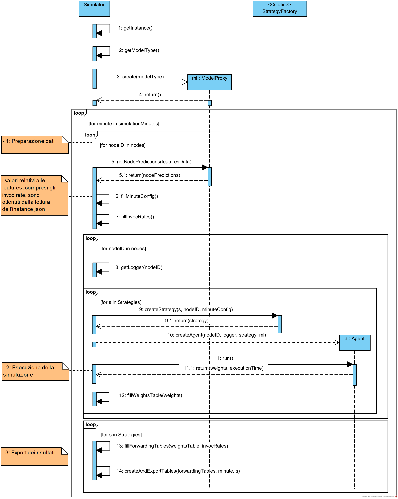
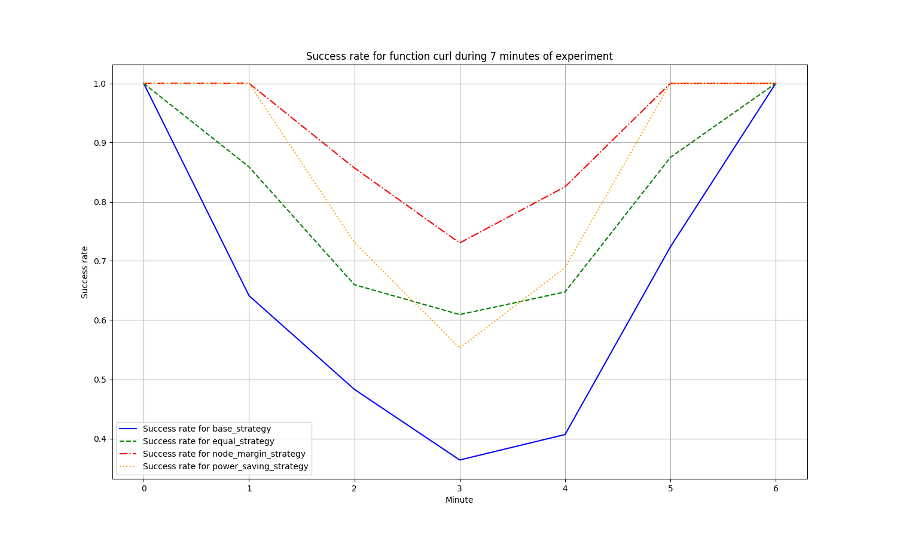
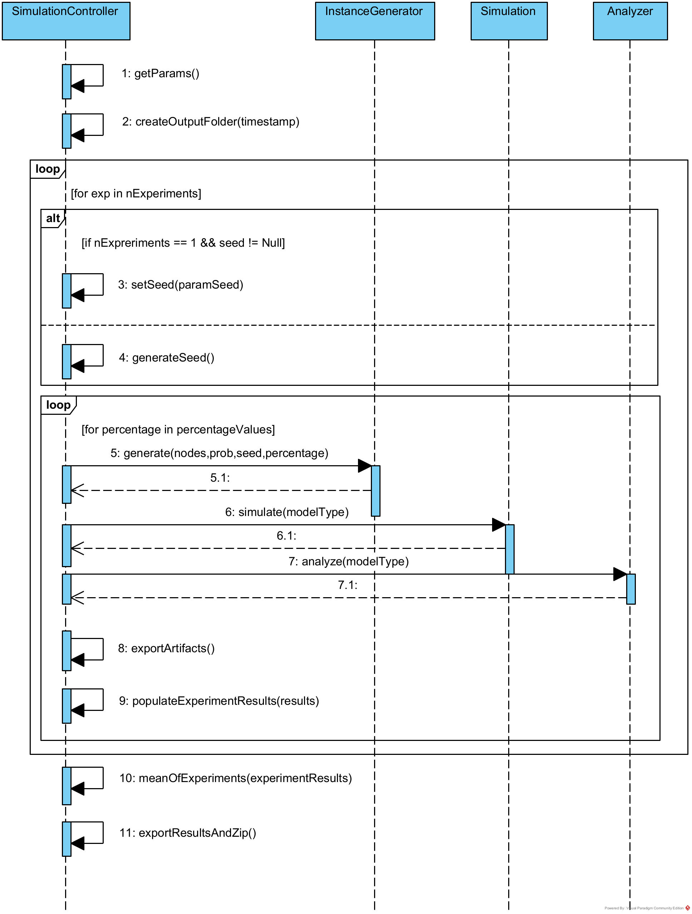

# Framework

The Framework has been realized with the aim of creating an environment where to implement and test varios load balancing strategies.

An high-level overview of the Framework modules, inputs and output is reported in the following image. This picture represent the UML Component Diagram of the simulator. In blu are highlighted main modules, in green their output artifacts and in orange the required files from the nodes modelling work.



The simulation takes place in **steps**, also called **simulation instants**; each of them corresponds to a different situation or configuration that must be simulated in terms of traffic to be balanced.

## Main components 

### Instance Generator

The purpose of this component is to generate the instance on which the simulation will be performed. Specifically, information regarding the peer-to-peer node network and the load that each node will have to handle for each simulation instance is generated in this phase. This script take 3 CLI arguments:

- **Nodes number**: Number of nodes to simulate;
- **Edge probability**: Probability to generate an edge between each pair of nodes;
- **Max percentage of overloaded nodes**: A percentage indicating the max number of nodes to be in overload during the simulation
- **Seed**: Seed used as starting point for pseudo-random generation process.

The artifact produced by this element are a generated json instance and an image of corresponding network topology. Both this elements can be found in **output/archive/[timestamp].zip** output directory.

### Model
The main objective of the model component is to provide a representation of the metrics prediction models within the Framework.

The implementation of the component was done by creating two classes:
- **Model**: this class is used to represent models within the System. It has five private attributes that allow it to uniquely identify a particular model;
- **ModelProxy**: this class serves as an access point for all components of the System that need to obtain predictions.

In the following picture a UML class diagram of this component is reported.


### Simulator

This component is concerned to execute all steps of simulation, calculating load balancing weights of each agent towards other agents of the network, using different techniques, and calculating forwarding tables. In this phase is executed _simulation.py_ script. 

It accepts as input a single parameter, namely **Model type**, that allows to specify which model to use among standard regression, 5% quantile regression, and 95% quantile regression.

This component is the main part of the **Framework** package and uses a various number of other components.
In the following picture a UML sequence diagram of simulator main operations is reported.



The **simulator**, reading an instance file, need to retrieve the metrics predictions of the current instant. This data are provided by the **Model** component, which requires as input the expected load values from the nodes in the network.

Each agent, during simulation, execute different load balancing strategies, providing the ability to use the metrics prediction models. How this classes are organized is represented in the following class diagram.


### Analyzer

This component analyze **Simulator** output files and calculate indexes used for comparison between different strategies. Like the Simulator, this module also makes use of models for its own purposes; for this reason, the type of model to be used (5% quantile regression, regression or 95% quantile regression) can be provided as input, which should reflect the choice made in the Simulator.

Main index calculated are:

1) **Success rate**: Percentage of requests managed with success by the system, applaying a specific load balancing technique;

2) **Success rate during stress period**: Percentage of requests managed with success by the system, applaying a specific load balancing technique, when the load is higher;

3) **Mean Node Power Consumption**: this index is intended to allow comparison on the average power consumption among different strategies;

4) **Max Node Power Consumption**: represents the maximum consumption value estimated on the nodes in the network;

5) **Reject number**: Number of rejected request by the system.

This script export a CSV file containing mean and median of these indexex. It also export comparison simulation graph that compares success rates of different startegies during simulation (see figure below).



### Simulation controller

Using this component to run a simulation simplifies the experimental phase because it automates the sequential execution of internal modules that would otherwise have to be run manually.

Acting as an entry point for the components contained within it, the Simulation Controller is set up to be able to handle all the parameters in those modules, with some differences:

1) The Simulation Controller is capable of receive as input one or more values of **Max percentage of overloaded nodes**, so that the same instance can be evaluated on different values of load;
2) The Simulation Controller allows you to specify an additional parameter, the **number of experiments**. This will generate and simulate n scenarios, and then then aggregate the indices obtained in the various experiments into unique values that can provide much more precise indications of performance. If number of experiments is greater than one, than values for the seed will not be accepted by the Simulation Controller.

In the following picture a UML sequence diagram of Simulation Controller main operations is reported.



All artifacts produced by this process are gathered in a zip file as name the timestamp, under [**output**](outputs/) directory.

## Configuration Manager

This utility class (_configuration/configuration\_manager.py_) contains all paramter, variables, strategy names, and settings of simulator. It also include the definitions of the **parameters** used by the **Node Margin Strategy** and the **Power Saving Strategy**.

- **Note**: is an algorithm is added to simulator or some paramters need to change, they must be changed in this configuration class.

## Implemented Strategies

During simulation are executed all load balancing strategies defined in _behaviour_ module, and added in _configuration/configuration\_manager.py_ class.

The implemented strategies are:

- **Base Strategy**. This strategy does not forward traffic, each agent use only its resources. This strategy is implemented in _behaviour/base\_strategy.py_;

- **Equal Strategy**. This strategy shares excess traffic equally among neighbors. This strategy is implemented in _behaviour/equal\_strategy.py_;

- **Node Margin Strategy**. This is the main distribuited load balancing algorithm. With this strategy each node balances its load according to the **margin** offered by its neighborhood. This strategy is implemented in _behaviour/node\_margin\_strategy.py_;

- **Power Saving Strategy**. declination of the Node Margin Strategy that allows a limit to be placed on energy consumption. This strategy is implemented in _behaviour/power\_saving\_strategy.py_.

All of the strategies returns as output a set of weights for each function from each agent towards others

### How to add other strategies

To add a new strategy it is only necessary create a new file in _behaviour_ module, and the new class must implement the _behaviour/strategy.py_ "interface". New class must implement run method and return a dictionary containing forwarding weights.

It is also necessary add new strategy name in _configuration/configuration\_manager.py_ file and add a case for strategy creation in _factory/strategy\_factory.py_ class.

## How to execute a simulation

For execute a simulation using **simulation controller** as entry point, first move on simulation folder from the project root.

```console
cd simulation
```

After that, type and execute the following command:

```console
python simulation_controller.py --nodesnum [integer number] --edgeprob [float probability between 0 and 1] --overloaded [one or more values of percentage] --expnum [integer number] --modeltype [a string among regression, quantile005, quantile095] --seed [integer number]
```
- **Note**: All parameters are optional.

Example: 

```console
python simulation_controller.py --nodesnum 10 --edgeprob 0.3 --overloaded 30 60 --expnum 1 --modeltype regression --seed 701 
```
- **Note**: If **expnum** is greater than 1, than seed cannot be specified:

```console
python simulation_controller.py --nodesnum 10 --edgeprob 0.3 --overloaded 30 60 --expnum 10 --modeltype regression
```

It is also possible to execute single scripts:

```console
python instance_generator.py --nodesnum 5 --edgeprob 0.3 --overloaded 40 --seed 711 
```

```console
python simulation.py --modeltype regression
```

```console
python analyzer.py --modeltype regression
```